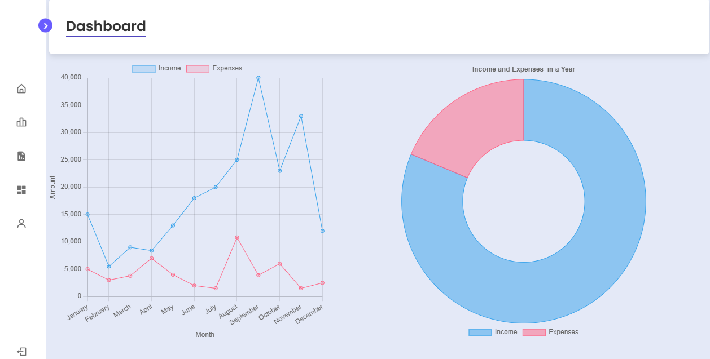
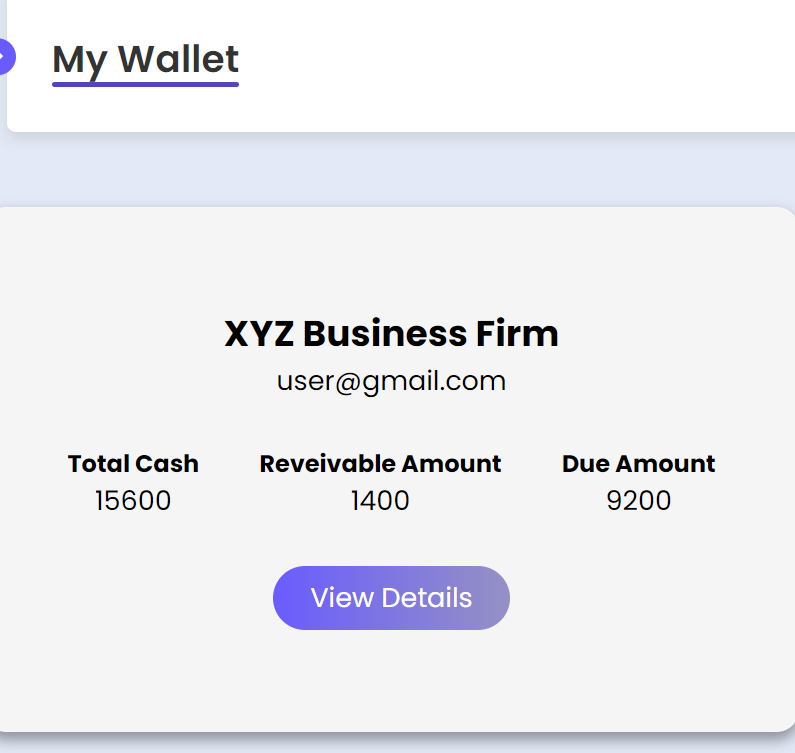
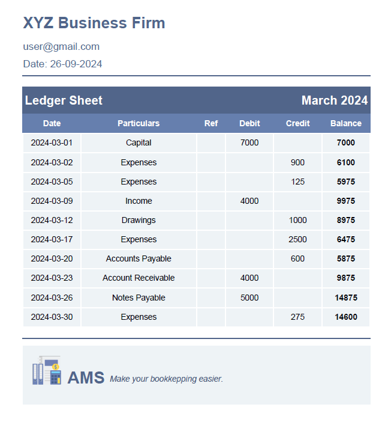

# 📊 Accounting Management System (AMS)

A database-driven web application developed as part of the **Database Management System Lab** at the **Department of Computer Science and Engineering, University of Chittagong**.

Built by undergraduate students:  
👩‍💻 Afia Tasnim Tahura 
👩‍💻 Umme Fahmida Trisha
👩‍💻 Toasean Elmah Tasean 

---

## 🚀 Project Overview

The **Accounting Management System (AMS)** helps students and small business owners manage financial records easily. With a user-friendly interface and real-time calculations, AMS offers:

- Recording of **Income**, **Expenses**, **Capital**, and **Drawings**
- Auto-generated financial statements:
  - Balance Sheet
  - General Journal
  - Income Statement
  - Ledger Sheet
- A **wallet summary** that tracks total cash, receivables, and dues
- Visual representations through charts and graphs

---

## 🛠️ Tech Stack

- **Frontend:** HTML, CSS, JavaScript  
- **Backend:** PHP  
- **Database:** MySQL   
- **Charting:** Chart.js (JavaScript)

---

## 📂 Features

- 🔐 Secure Login Authentication
- 🔁 Full CRUD Functionality (Income, Expense, etc.)
- 📄 Financial Reports and Statement Generation
- 📊 Monthly Income & Expense Charts (Line + Donut)
- 💰 Wallet Summary Calculation
- 📈 Chart.JS based Visual Analytics

---

## ⚙️ Installation Guide

### Step 1: Install XAMPP

Download and install [XAMPP](https://www.apachefriends.org/index.html)

### Step 2: Start Apache and MySQL

Launch XAMPP Control Panel and start Apache & MySQL.

### Step 3: Clone This Repository

```bash
git clone https://github.com/fahmida027/AMS.git
```

### Step 4: Move Project to `htdocs`

Copy the entire project folder into your XAMPP `htdocs` directory.

### Step 5: Set Up the Database

1. Visit `http://localhost/phpmyadmin`
2. Create a new database (e.g., `amstest`)
3. Import the provided `amstest.sql` file located in the project folder

### Step 6: Run the Web App

Open your browser and go to:

```
http://localhost/AMS/src/login.php
```

Use the following demo credentials to log in:

```
Username: xyz@gmail.com  
Password: Abc1234$
```

Or, you can create your own account.
 
 
---

## 📷 Screenshots

### 🔐 Home Page
.png)

### 🧾 Dashboard


### 📊 Wallet


### 🧮 Financial Report


---

## 📜 License

This project is created for academic and learning purposes.  
If you'd like to contribute, raise an issue or pull request.

---

## 🌐 Contact

For suggestions or collaboration opportunities: <br>
📧 afia.csecu@gmail.com | 🔗 [LinkedIn Profile](https://www.linkedin.com/in/afia-tasnim-tahura-007852271/) <br>
📧 fahmida.csecu@gmail.com | 🔗 [LinkedIn Profile](https://www.linkedin.com/in/umme-fahmida-trisha-544b78333/) <br> 
📧 toasean.csecu@gmail.com <br>
🔗 [LinkedIn Profile](https://www.linkedin.com/in/toasean-elmah-tasean-b70a66286/)

